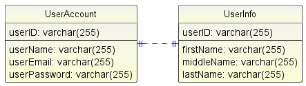

user_information.sql is the database uesd in this project.

The database consists of 2 tables:
1. userAccount:
    userID: VARCHAR(255)        -- PRIMARY KEY AND UNIQUE (SHA256 HASH)
    userName: VARCHAR(255)      -- UNIQUE
    userEmail: VARCHAR(255)     -- UNIQUE
    userPassword: VARCHR(255)   -- ARGON2 HASH AND SALT

2. userInfo
    userID: VARCHAR(255)        -- PRIMARY KEY AND UNIQUE
    firstName: VARCHAR(255) 
    middleName: VARCHAR(255)
    lastName: VARCHR(255)

